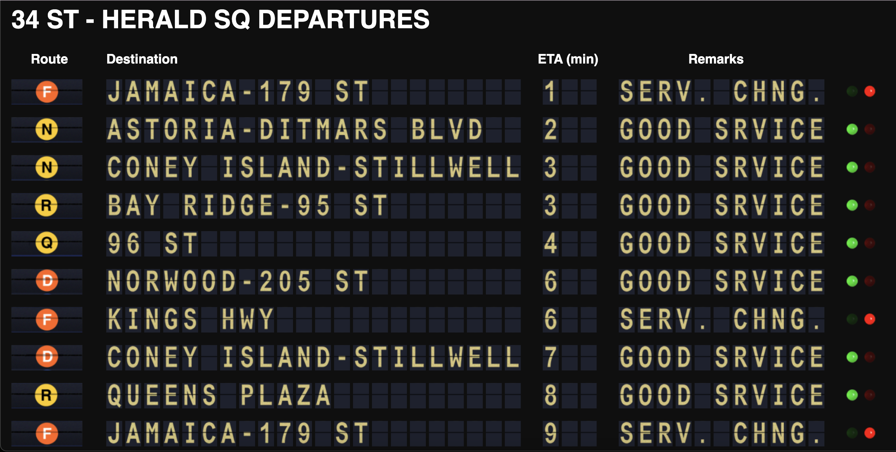

# Virtual Split-Flap Display

================================
## There is a new, simpler version of this project here: [Subway Split Flap v1.5](https://github.com/DavidTropiansky/Subway-Split-Flap-Solari-v1.5).
================================



This is a simulation of a split-flap display (often called a Solari board) designed to run locally in a web browser. It dynamically loads JSON data from the MTA data feeds and renders that data as characters and images on the board. Individual characters are animated using CSS sprites.

This board is fully configurable by changing the markup and using different sprite images, and the included files can help you get started if you wanted to emulate NYC Subway data, or your own project. The board can be run on a vertical or horizontal monitor. You may want to change the number of rows loaded and data to pull depending on your needs. 

This project utilizes the split flap template from [baspete's project](https://github.com/baspete/Split-Flap/), and the Python code is based off of [lightalan's project](https://github.com/lightalan/subwayclock).


## Running the Program
To run a functional copy, you will need to request an API key from the MTA. After that, look at the stations.csv file to look up the station code you need. 
34th St Herald Square is left as an example station. If you want to see northbound and southbound departures, you need to use D17N and D17S
```
D - The Route as designated by the MTA
17 - The station number of that route
N - Northbound departures only 
```
Make sure all dependencies are installed

```
git clone https://github.com/DavidTropiansky/Subway-Split-Flap-Solari/
cd Split-Flap
conda env create -f environment.yml
conda activate transit
npm install
```
You **need** to change the file paths in Raw_Subway_Feed.py and in app.js to local paths on your machine, along with inputting your own API key. 
The python program pulls both arrival times and service status from the MTA feeds. For service status, 'Good Service' is anything that is not planned service changes, or if no service changes or found. "Serv. Chng.' only occurs when there is an unplanned service disruption. It can either be a Delay in service, or an unplanned change in service. 

Once you plug in your API key, set up the directory for the required input/output files in the Python code. You will also need to adjust jsonFilePath in app.js to read the live data. After this is done, run the python program 'Raw_Subway_Feed.py', followed by 'app.js'. 
Then, navigate to `http://locahost:8080` in your browser and you're good to go. Happy traveling! 

## Customization

The look and feel is customized by changing the markup, CSS and sprite images. Of course, any size changes you make to the images must be reflected in the sprite images and vice-versa.

The display refresh interval and the data source url are set in the `<script>` block at the bottom of the HTML pages. Make sure this interval is set long enough so that the entire display has finished rendering before starting again.

The row refresh cascade interval is set in the setTimeout() function in sf.chart.render(). Setting this too low results in a jerky animation as too many elements animate at once and slow your processor.

The individual elements' animation speed is set in the fadeIn() and fadeOut() functions in sf.chart.splitFlap.show()


## Application Structure

`/public/js` - The client-side code is in `split-flap.js`. This code loads jquery, underscore and backbone from dnjs.cloudflare.com. You may wish to change this if your application will run disconnected.

`/public/img` - Image sprites. Customize these to change the look of the split flap elements or utilize different character sets or status indicators. I've included the .pxd file(s) so you can edit these in Pixelmator.

`/public/css` - The base styles for this application. These can be extended or overridden by adding your own in `/public/plugins`. Note how the `.full`, `.character` and `.number` definitions here define different (sub)sets of images on the character sprites. If you edit the character sprites you must also edit these classes to match.

`public/index.html` - Example HTML to render into the browser. This is where you define the layout of your board and define some basic constants.

`/public/plugins` - Custom Javascript, CSS and images. Use these as a starting point to connect to new data sources, change the look and feel, etc.

`/app.js` - A simple Node.js application to serve static files (HTML, Javascript, CSS and images) and to serve JSON data to populate the displays. If you already have a web/application server you might not need this file.

## Data

The example Node app at `app.js` exposes an API route at `/api/arrivals` which demonstrates sending data to `split-flap.js`.

```

    data: 

[
    {
        "route_id": "D",
        "last_stop_id": "D01N",
        "arrival_time": 1,
        "last_stop_name": "Norwood-205 St",
        "service_status": "Good Srvice"
    },
    {
        "route_id": "F",
        "last_stop_id": "F35S",
        "arrival_time": 3,
        "last_stop_name": "Kings Hwy,",
        "service_status": "Serv. Chng."
    },
    {
        "route_id": "F",
        "last_stop_id": "F35S",
        "arrival_time": 8,
        "last_stop_name": "Kings Hwy",
        "service_status": "Serv. Chng."
    },
    {
        "route_id": "Q",
        "last_stop_id": "D40S",
        "arrival_time": 2,
        "last_stop_name": "Brighton Beach",
        "service_status": "Serv. Chng."
    }
]    
```

The files in `/public/plugins` are used to set the URL for the data and process the results. See `/public/plugins/adsb/custom.js` for an example.
